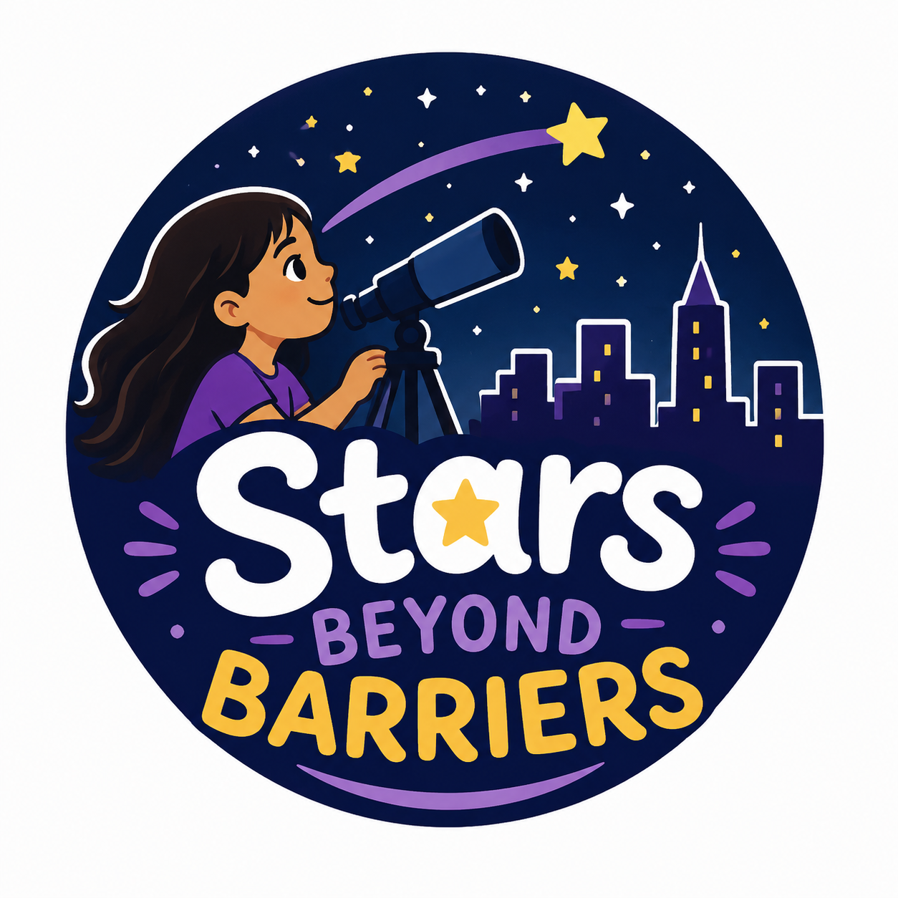
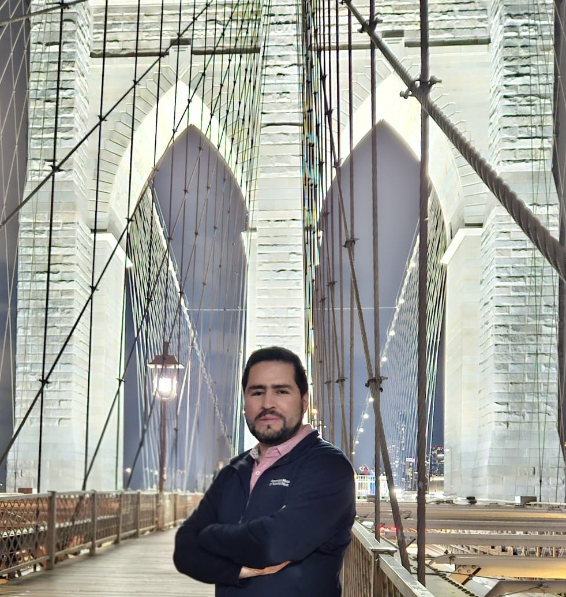
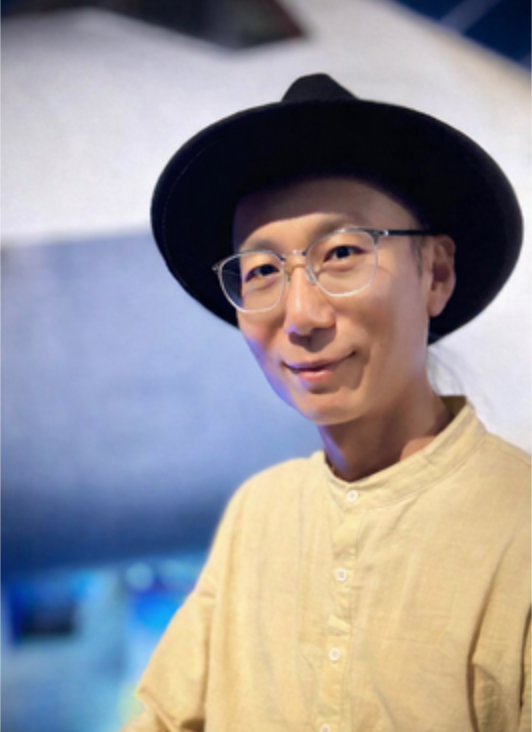
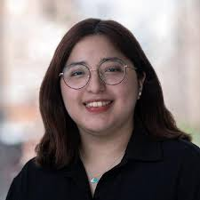

<link rel="stylesheet" href="/stars-beyond-barriers/assets/css/custom.css">

  

**Stars Beyond Barriers** aims to inspire and support students from underrepresented groups, particularly Latina women, to pursue STEM by serving as a bridge between students and well-established science programs that provide mentorship, research opportunities, and pathways toward STEM careers.

This initiative was inspired by the [Women and Girls in Astronomy Program](https://naroad.astro4dev.org/2026/04/08/womens-and-girls-in-astronomy-program-2026-call-for-proposal/) by the North American Regional Office of Astronomy for Development (NA-ROAD). Support and partnership through this program are currently pending review.

Program Activities

Focused on students' professional and academic growth, participants will engage in:

- Astronomy lectures and immersive tours at the Hayden Planetarium
- Visits to research laboratories
- Conversations with female researchers
- Mentorship on research fundamentals
- Workshops designed to prepare students for and facilitate their inclusion in STEM programs

Venue

The program will be hosted at the [American Museum of Natural History](https://www.amnh.org/), primarily within the [Department of Astrophysics](https://www.amnh.org/research/physical-sciences/astrophysics), in New York City.

Participants

This program is aimed at high school and undergraduate female students in Latino communities in NYC. We will select a cohort of 10 students.

Additional information about eligibility, application requirements, and timelines will be announced soon.

<table>
  <tr>
    <td align="center">
       
      <strong>Student Name</strong> 
      School Name
    </td>

    <td align="center">
       
      <strong>Student Name</strong> 
      School Name
    </td>

    <td align="center">
       
      <strong>Student Name</strong> 
      School Name
    </td>

    <td align="center">
       
      <strong>Student Name</strong> 
      School Name
    </td>

    <td align="center">
       
      <strong>Student Name</strong> 
      School Name
    </td>
  </tr>

  <tr>
    <td align="center">
       
      <strong>Student Name</strong> 
      School Name
    </td>

    <td align="center">
       
      <strong>Student Name</strong> 
      School Name
    </td>

    <td align="center">
       
      <strong>Student Name</strong> 
      School Name
    </td>

    <td align="center">
       
      <strong>Student Name</strong> 
      School Name
    </td>

    <td align="center">
       
      <strong>Student Name</strong> 
      School Name
    </td>
  </tr>
</table>

Targeted Programs

### For High School Students

- [The Science Research Mentoring Program (SRMP)](https://www.amnh.org/learn-teach/teens/science-research-mentoring-program) at AMNH, which provides NYC high school students with research opportunities, professional development, and advisory sessions throughout the academic year.
- *Additional opportunities will be added soon.*

### For Undergraduate Students

- [Research Experiences for Undergraduates (REU)](https://www.nsf.gov/funding/initiatives/reu), a program that supports undergraduate students conducting summer research at institutions across the United States.
- [The AstroCom NYC program](https://cunyastro.org/astrocom/), which pairs undergraduate students with mentors from AMNH, CUNY, and the Flatiron Institute.
- [TEAM-UP Together Undergraduate Research Fellowship (TURF)](https://www.teamuptogether.org/students/team-up-together-research-fellowship), which supports undergraduate students with limited access to research opportunities through mentorship and research experiences at diverse institutions.
- [The Gray STEM Scholars program at Macaulay Honors College (CUNY)](https://macaulay.cuny.edu/opportunities/special-honors-programs/gray-stem-scholars/), which supports undergraduate students pursuing careers in STEM research.
- *Additional opportunities will be added soon.*

Organizers

<table>
  <tr>
    <td align="center">
      <a href="https://gsuarezcastro.wixsite.com/gsuarez">
         
        <strong>Genaro Suárez</strong>
      </a> 
      Postdoc at AMNH
    </td>

    <td align="center">
      <a href="https://sites.google.com/view/jameshhchan/home">
         
        <strong>James Chan</strong>
      </a> 
      Postdoc at AMNH
    </td>

    <td align="center">
      <a href="https://sherelyna.github.io/">
         
        <strong>Sherelyn Alejandro Merchán</strong>
      </a> 
      PhD student at CUNY
    </td>
  </tr>
</table>

## Get Involved

Interested in participating or collaborating? Contact us at the emails below to learn more:
TBD

## Sponsors and Acknowledgments
TBD
